# System Design Diagrams

These diagrams represent the target architecture and final-stage workflows for the drag-and-drop puzzle generator.

## C4 and High-Level Architecture

### C4 Container

### Deployment

### Folder Dependencies

## Core Runtime Sequences

### Generate Sequence

### Drag and Snap

### Check Validation

### Hint Flow

### Hint Cooldown

### Undo / Redo

## State Lifecycles

### Puzzle Lifecycle

### History Lifecycle
